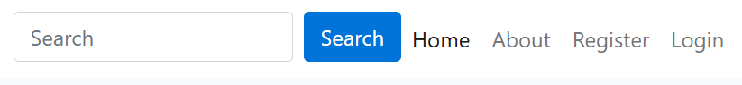
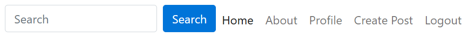
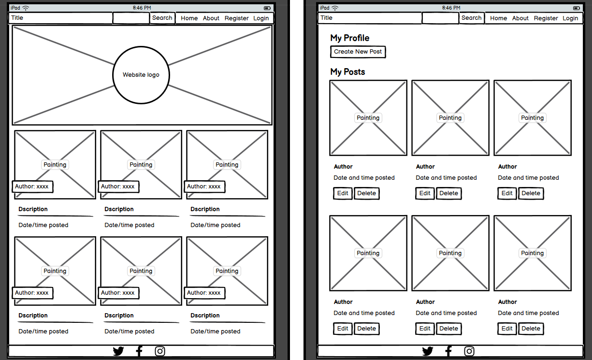

# Kids-Art  <a id="top"/>

## Introduction

The "Kids-Art" has been designed and implemented as the final project for the Code Institute's 16-week AI-Augmented Full Stack Development Bootstrap course. 

This project was envisioned as a way for parents to share their kids artwrok with their relatives, and later also thought that it could be extended to other people to see different artwork from kids around the world. 

Main objective is to showcase the use of DJango, Database management, and CRUD functionality. 

Live site: [Kids-Art](https://kids-art-03ecd75b696a.herokuapp.com/)

## Table of Contents
- [Kids-Art](#kids-art)
    - [Introduction](#introduction)
    - [Table of Contents](#table-of-contents)
    - [Overview](#overview)
- [Ux - User Experience](#ux---user-experience)
    - [Colour Scheme](#colour-scheme)
    - [Contrast Check](#contrast-check)
    - [Typography](#typography)
- [Project Planning](#project-planning)
    - [Strategy Plane](#strategy-plane)
      - [Agile Methodologies](#agile-methodologies)
      - [Users](#users)
      - [MoSCoW Prioritorization](#moscow-prioritorization)
      - [User Stories](#user-stories)
    - [Scope Plane](#scope-plane)
    - [Structural Plane](#structural-plane)
      - [Homepage](#homepage)
        - [Footer](#footer)
        - [Pagination](#pagination)
      - [Profile](#profile)
      - [Create Post](#create-post)
    - [Skeleton & Surface Planes](#skeleton--surface-planes)
      - [Wireframes](#wireframes)
      - [Imagery](#imagery)
- [Technologies Used](#technologies-used)
    - [Languages and Technologies](#languages-and-technologies)
    - [Libraries](#libraries)
    - [Tools and Programs](#tools-and-programs)
- [Deployment](#deployment)
    - [Connecting to GigHub](#connecting-to-github)
    - [Django Project Setup](#django-project-setup)
    - [Cloudinary API](#cloudinary-api)
    - [Heroku Deployment](#heroku-deployment)
    - [Clone Project](#clone-project)
    - [Fork Project](#fork-project)
- [ERD](#erd)
- [Bugs to fix](#bugs-to-fix)
- [AI Implementation and Orchestration](#ai-implementaion-and-orchestration)
    - [Code Generation](#code-generation)
    - [Debugging](#debugging)
    - [Code Optimization](#code-optimisation)
    - [Impact on Workflow](#impact-on-workflow)
- [Testing](#testing)
    - [HTML Validation](#html-validation)
    - [CSS Validation](#css-validation)
    - [Lighthouse Audit](#lighthouse-audit)
    - [Python Tests](#python-tests)
- [Future Features](#future-features)
- [Credits](#credits)
    - [Code References](#code-references)
    - [Media References](#media-references)
    - [Acknowledgments](#acknowledgements)
    - [Owner Details](#owner-details)

[Back to top](#top)

# Overview
Kids-Art is a simple, minimalist website with paintings from kids, with the need to register to create new posts and leave comments on other users posts. 
It's meant to be an interactive, responsive site.

 - Users have direct access to posts on the homepage
 - Possibility to create posts after registering on the site
 - Ability to edit or remove posts contents if logged in
 - Comment on posts after log in
 - Feature to contact page admin and be a collaborator
 - About page, explaining how the site works

The site is responsive in different screen sizes and accessible in different web browsers, to ensure a smooth experience on different devices. 
Kids-Art mais goal is to create a community to share your kids artwork but also to share their simplicity, watch it improve and share happiness while seeing different posts on the site.

## UX - User Experience

The layout for this website was inspired in other websites with activities for kids but not showing their artwork. More directed to present and explain playfull activities for parents or other users to do with kids. 

So I fought about doing a blog initially, but then, came the idea of making it available for other people to also use the site. 

The name "Kids-Art" came for simplicity, to mix the 2 main goals of the site: "kids" and "art", also needing to search for other sites, that as far, as researched don't have the same name. 

The "splash" can be found in kids clothes when they pain, can also be a bit of paint they trow to the canvas or a simple paint droplet as result of playful moments with relatives or freinds. 

The short "motto" enhances what the site is about. 

## Colour Scheme
For Kids-Art, I tried to select colors that create a high contrast for easier readability, with light colors to keep the site simple and open to everyone.

 - #000080 - Navy blue
 - #CAF2FF - Water
 - #FFFFFF - White
 - #000000 - Black
 - #0074D9 - True Blue

## Contrast check  
   
  

## Typography
Initial website font-family was Roboto and Lato.

  - [Roboto](https://fonts.google.com/specimen/Roboto)
  - [Lato](https://fonts.google.com/?query=Lato)

For the website logo and title, used Caveat Brush and Open Sans, as per bellow images:
   
  

# Project Planning
The main goal for this project was to create a fun and simple website, easy to use and accessible in different devices.

## Strategy Plane

  - User-friendly platform to post artwork
  - Appealing and minimalistic layout and colors
  - Show simple and easy to select menus
  - Provide an intuitive UI for efficient CRUD functionality related to posts creation and comments
  - Ensure consistent UX thoughout multiple platforms, as mobile devices, tablets, and desktops
  - Develop a platform that can be improved with new features in the future

All the above, aiming to create a seamless experience for the user, where memories can be saved and hopefully talent can be shown.

## Agile Methodologies
Kids-Art was my third project, and the second individual one, with our facilitator and coaches motivating us to showcase our abilities, from the initial idea, to planning the website, think about the essential features for the MVP and others that could be added later, if not working on time for project submission.

We were reminded to try to add small parts and test them before commiting the changes and them ppushing them to the main repo.

The main features can be seen on the [GitHub Project Board](https://github.com/users/Carlos-n21/projects/16/views/1).

With each iteration of the Agile methogologies, the website was improved and I did my best to improve my skills and knowledge of the project management, which I had used in previous projects, but that can always be improved.

These will also be very important for future projects, either personal or professional, with Hackathons being a great way to also get more practice with Agile methodologies.

### Users
Persona 1: The Proud Parent 
Name: Sarah Thompson  Age: 35  Occupation: Marketing Manager  Interests: Family time, photography, gardening  About: Sarah is a busy mom of two, always looking for ways to celebrate her children's creativity. She loves sharing their artwork with family and friends and is an active participant in online communities. Sarah values positive feedback and is eager to connect with other parents who appreciate the joys of raising young artists.

Persona 2: The Aspiring Artist 
Name: Emily Harris  Age: 11  Occupation: Student  Interests: Drawing, painting, reading fantasy books  About: Emily is a young, talented artist who dreams of becoming a professional illustrator one day. She enjoys posting her artwork online and is keen on receiving constructive feedback to improve her skills. Emily loves interacting with other young artists and learning new techniques from them.

Persona 3: The Supportive Grandparent
Name: Robert Miller  Age: 68  Occupation: Retired Teacher  Interests: Reading, woodworking, spending time with grandchildren  About: Robert is a proud grandfather who cherishes his grandchildren's creative expressions. He enjoys logging in to the website to see their latest masterpieces and leave encouraging comments. Robert also appreciates connecting with other grandparents and sharing stories about their grandkids' artistic journeys.

## MoSCoW Prioritorization

I followed the MoSCoW Prioritization method for this project, identifying and labelling my:

  - Must Haves: the 'required', critical components of the project. Needed to reach the MVP (Minimum Viable Product) as early as possible, allowing me to develop the project further, if possible

  - Should Haves: the components that add value to the project, but are not absolutely 'vital' in the MVP stage. The 'Must Haves' receive priority over the 'Should Haves'.

  - Could Haves: features that are a 'bonus' to the project, that would be nice to have in this phase, but only if the most important issues have been completed first and time allows.

## User Stories
Here are all the user stories that have been prioritised (all must have and some should have ones) for the current implementation of the site:
| User Stories                                    | MoSCoW priority           |  Status      |
| ----------------------------------------------- |:-------------------------:| ------------:|
| Homepage                                        | must have                 |  Done        |
| About Page                                      | must have                 |  Done        |
| Login Page                                      | must have                 |  Done        |
| Registration Page                               | must have                 |  Done        |
| User Profile                                    | must have                 |  Done        |
| Comment posts                                   | should have               |  In Progress |
| Navbar Update for Logged-in Users               | must have                 |  Done        |
| Admin Review/Moderation                         | could have                |  Done        |
| Responsive Design                               | must have                 |  Done        |
| Add more admins                                 | should have               |  Done        |
| Create albums                                   | could have                |  Not Done    |
| Like posts                                      | could have                |  Not Done    |
| Saving drafts                                   | should have               |  In progress |
| Create albums                                   | could have                |  Not Done    |
| Like posts                                      | could have                |  Not Done    |

All user stories were logged on the [GitHub Project Board](https://github.com/users/Carlos-n21/projects/16/views/1) on GitHub repo.

[Back to top](#top)

## Scope Plane
Kids-Art was the Individual Capstone Project for the Full Stack Bootcamp at Code Institute, it is designed to be a learning experience and a functional artwork sharing platform.  

This project uses technologies such as Django, SQL, Bootstrap, and Cloudinary for image handling.  

Following Agile Planning Methodologies, User Stories and Developer Tasks were added as issues on the GitHub project board.

Essential features of this site include:

  - A visually appealing, accessible website, meeting the user needs
  - Responsive design for mobile, tablet, and desktop devices
  - User Authentication and Registration
  - Comment on posts with full CRUD functionality
  - User Profile creation and editing
  - Create posts with full CRUD function
  - Basic search function for posts

## Structural Plane
Kids-Art tries to be a simple and fun experience for users to share their stories through images with their families and friends. Trying to provide a seamless experience. 
Structurally, the website should provid a responsive design, ensuring  accessibility in different devices, and inludes a main page, about page, registration page, login page, profile page for logged in users with all the posts created by the user with option to update/change or delete them, post creation page, and an administrative page for content moderation, as/if needed.

## Homepage
  
  
  
The navbar allows the user to navigate through the different areas of the site when not registered. 
When the user is on his account, allows to also see their profile, with all the posts created, also to create, edit and delete a post

### Footer
  

The footer contains links to different social networks that the site admin could use to post news about the website and to get more users to the website.

### Pagination
  

Have the number of pages on the bottom of the page allows the user, not just to move to the next or previous page, but also to go to a specific page, reducing the overload of content on one page and making it easier to access different pages quicker than just one at a time.

## Profile
  

Allows the user to see the post created, with option to edit them (in a different page) or to delete with a confirmation message.

## Create Post
  

The user can create a new post, after filling all the fields presented, except the Slug, that is automatically filled when filling the Title.

# Skeleton & Surface Planes
## Wireframes
The wireframes for this website were created using Balsamiq Wireframes, which provide a visual idea of the project design concept.

This software is user-friendly and an efficient tool to create web design mock-ups, with the option to select different device frame sizes.

They are designed to provide a modular structure, that envisions what could be the layout of the website/app.

Layout of website:

- Mobile view: 
  
  
  
   
- Tablet view: 
   

Only done 2 views for tablet view as view is the same for tablet and computer screens 
Furhter images for other features on mobile view not included as the layout is the same for different screen sizes.

[Back to top](#top)

## Imagery
Some of the original sites used to get images for ficticious posts on the website.

  - [phhere.com](https://pxhere.com/en/photo/887571)
  - [NPS](https://www.nps.gov/neri/learn/news/youth-arts-in-the-parks-2023-art-contest-near-deadline.htm)

Hero Image
  
  
Logo Image 
   
  
[Back to top](#top)

## Technologies Used
### Languages and Technologies
  - HTML
  - CSS
  - JavaScript
  - Python
  - PostgreSQL
  - Git
  - Github
  - VS-Code
  - Django
  - Cloudinary
  - Heroku

### Libraries
  - Bootstrap v5.2.3
  - Django v3.2.19
  - Django AllAuth v0.54.0
  - Django Crispy Forms v2.0
  - Google Fonts
  - Crispy Bootstrap5 v0.7
  - Django Summernote v0.8.2
  - Pillow v9.5

### Tools and Programs
  - Balsamiq wireframe
  - MSCopilot AI
  - VS-Code Copilot
  - ChatGPT

[Back to top](#top)

## Deployment

### Connecting to GitHub
To begin this project from scratch, you must first create a new GitHub repository using the Code Institute's Template. This template provides the relevant tools to get you started. To use this template:

  - Log in to GitHub or create a new account. 
  - Navigate to the above CI Full Template. 
  - Click 'Use this template' -> 'Create a new repository'. 
  - Choose a new repository name and click 'Create repository from template'. 
  - In your new repository space, click the purple CodeAnywhere (if this is your IDE of choice) button to generate a new workspace. 

### Django Project Setup 
Install Django and supporting libraries: 
  - pip3 install 'django<4' gunicorn 
  - pip3 install dj_database_url psycopg2 
  - pip3 install dj3-cloudinary-storage 

Once you have installed any relevant dependencies or libraries, such as the ones listed above, it is important to create a requirements.txt file and add all installed libraries to it with the pip3 freeze --local > requirements.txt command in the terminal.

Create a new Django project in the terminal django-admin startproject ems .

Create a new app eg. python3 mangage.py startapp events

Add this to list of INSTALLED_APPS in settings.py - 'booking',

Create a superuser for the project to allow Admin access and enter credentials: python3 manage.py createsuperuser

Migrate the changes with commands: python3 manage.py migrate

An env.py file must be created to store all protected data such as the 
DATABASE_URL and SECRET_KEY. These may be called upon in your project's settings.py file along with your Database configurations. The env.py file must be added to your gitignore file so that your important, protected information is not pushed to public viewing on GitHub. For adding to env.py:

  - import os
  - os.environ["DATABASE_URL"]="<copiedURLfrom postgresql://neondb_owner>"
  - os.environ["SECRET_KEY"]="my_super^secret@key"

For adding to settings.py:

  - import os
  - import dj_database_url
  - if os.path.exists("env.py"):
  - import env
  - SECRET_KEY = os.environ.get('SECRET_KEY') (actual key hidden within env.py)

Replace DATABASES with:

DATABASES = { 
    'default': dj_database_url.parse(os.environ.get("DATABASE_URL")) 
  }

Set up the templates directory in settings.py:
  - Under BASE_DIR enter TEMPLATES_DIR = os.path.join(BASE_DIR, ‘templates’)
  - Update TEMPLATES = 'DIRS': [TEMPLATES_DIR] with: 
  os.path.join(BASE_DIR, 'templates'), 
  os.path.join(BASE_DIR, 'templates', 'allauth') 
  - Create the media, static and templates directories in top level of project file in IDE workspace. 
  
A Procfile must be created within the project repo for Heroku deployment with the following placed within it: web: gunicorn ems.wsgi

Make the necessary migrations again.

### Cloudinary API
Cloudinary provides a cloud hosting solution for media storage. All users uploaded images in the FreeFid project are hosted here.

Set up a new account at Cloudinary and add your Cloudinary API environment variable to your env.py and Heroku Config Vars. In your project workspace:

  - Add Cloudinary libraries to INSTALLED_APPS in settings.py
  - In the order: 
   'cloudinary_storage', 
   'django.contrib.staticfiles',   
   'cloudinary', 

  - Add to env.py and link up with settings.py: os.environ["CLOUDINARY_URL"]="cloudinary://...."
  - Set Cloudinary as storage for media and static files in settings.py:
  - STATIC_URL = '/static/' 
  STATICFILES_STORAGE = 'cloudinary_storage.storage.StaticHashedCloudinaryStorage'   
  STATICFILES_DIRS = [os.path.join(BASE_DIR, 'static'), ] 
  STATIC_ROOT = os.path.join(BASE_DIR, 'staticfiles')‌   
  MEDIA_URL = '/media/'   
  DEFAULT_FILE_STORAGE = 'cloudinary_storage.storage.MediaCloudinaryStorage' 

### Heroku deployment
To start the deployment process , please follow the below steps:

  - Log in to Heroku or create an account if you are a new user.

  - Once logged in, in the Heroku Dashboard, navigate to the 'New' button in the top, right corner, and select 'Create New App'.

  - Enter an app name and choose your region. Click 'Create App'.

  - In the Deploy tab, click on the 'Settings', reach the 'Config Vars' section and click on 'Reveal Config Vars'. Here you will enter KEY:VALUE pairs for the app to run successfully. The KEY:VALUE pairs that you will need are your: 
CLOUDINARY_URL: cloudinary://.... 
DATABASE_URL:postgres://... 
DISABLE_COLLECTSTATIC of value '1' (N.B Remove this Config Var before deployment), 
PORT:8000 
SECRET_KEY and value 

  - Add the Heroku host name into ALLOWED_HOSTS in your projects settings.py file ->  ['800-nielmc-django-project-lxqprmm3qz.us2.codeanyapp.com', '.herokuapp.com', 'localhost', '127.0.0.1'].

  - Once you are sure that you have set up the required files including your requirements.txt and Procfile, you have ensured that DEBUG=False, save your project, add the files, commit for initial deployment and push the data to GitHub.

  - Go to the 'Deploy' tab and choose GitHub as the Deployment method.

  - Search for the repository name, select the branch that you would like to build from, and connect it via the 'Connect' button.

  - Choose from 'Automatic' or 'Manual' deployment options, I chose the 'Manual' deployment method. Click 'Deploy Branch'.

  - Once the waiting period for the app to build has finished, click the 'View' link to bring you to your newly deployed site. If you receive any errors, Heroku will display a reason in the app build log for you to investigate. DISABLE_COLLECTSTATIC may be removed from the Config Vars once you have saved and pushed an image within your project, as can PORT:8000.

### Clone project
A local clone of this repository can be made on GitHub. Please follow the below steps:

  - Navigate to GitHub and log in.
  - Kids Art Repository can be found at this location.
  - Above the repository file section, locate the 'Code' button.
  - Click on this button and choose your clone method from HTTPS, SSH or GitHub CLI, copy the URL to your clipboard by clicking the 'Copy' button.
  - Open your Git Bash Terminal.
  - Change the current working directory to the location you want the cloned directory to be made.
  - Type git clone and paste in the copied URL from step 4.
  - Press 'Enter' for the local clone to be created.
  - Using the pip3 install -r requirements.txt command, the dependencies and libraries needed for FreeFido will be installed.
  - Set up your env.py file and from the above steps for Cloudinary and NeonSQL, gather the Cloudinary API key and the Neon SQL url for additon to your code.
  - Ensure that your env.py file is placed in your .gitignore file and follow the remaining steps in the above Django Project Setup section before pushing your code to GitHub.

### Fork Project
A copy of the original repository can be made through GitHub. Please follow the below steps to fork this repository:

  - Navigate to GitHub and log in.
  - Once logged in, navigate to this repository using this link Eventia Repository.
  - Above the repository file section and to the top, right of the page is the 'Fork' button, click on this to make a fork of this repository.
  - You should now have access to a forked copy of this repository in your Github account.
  - Follow the above Django Project Steps if you wish to work on the project.

[Back to top](#top)

### ERD

  

### Bugs to fix
- When creating a new post, only able to publish and not safe as draft at the momment, site crashing, tried to debug, but unable to fix by the time of subimssion.
- "Currently" (image) on "Edit Post" page not showing link or image. Image showing under content. Was able to get this working once, but did not saved it, and was not able to get it to work again. Image still shows at the bottom, before update but extra field looks to be part of crispy forms and was not able to make it work.
- HTML validation for Register (signup page) showing errors that I tried to search on VS-Code and Gitpod but unable to find files to change/correct the code.

[Back to top](#top)

## AI Implementaion and Orchestration
### Code Generation
The GitHub Copilot extension was installed in my local version of Visual Studio Code.  
I was able to write prompts or highlight functions in pseudocode and ask Copilot to suggest code snippets.  
Had to review suggestions before they were included, as AI can generate code that can refer to different features than the ones intended. 
In this project, Copilot helped with the user account code and different pages creation for this to work as well as in the adaptation of the "Blog" project to the intended site.

### Debugging
Regularly uesd Copilot for debugging code using the inline editor and also prompting to on VS-Code side chat to request changes to the site and content for the site, as in the About section, that was changed from original project from Code Institute, to meet the needs of my view for the site. 

### Code Optimisation
When needing to make more complicated changes to code or part of a page, Copilot was used to help fixing them and these were generally tested before pushing to repo. 
It was a great experience to work with AI in this project. 
Using Copilot extension on VS-Code showed me different libraries that where needed for the site to work well, like Pillow libraries from Python, to allow the site to show images uploaded by the user to Cloudinary, as the original project was a written blog with small images next to the title and this was meant to be a different post with images, which was adapted to for the website purposes. 

### Impact on Workflow
Overall It was useful to work with Copilot and have help to build many parts of the site. 
AI was also a good help to debug and test the code. 
Copilot and other AI as Claude in different ways, have explained the different steps involved in the coding, why some code is better than another. 
Sometimes it can be furstrating to get some suggestions with ghost code that is not needed for the page to work well or changing different pages/files instead of only 1 ir 2 lines of code to fix a bug, but with testing, errors can be fixed. 
Generally, adapting the prompts to make the request specific and concise can help Copilot to give better suggestions to get new features and to improve the site.

## Testing
Validation of HTML/CSS, Lighthouse Audits, Bugs

### HTML Validation
Used [W3C Markup Validation Service](https://validator.w3.org/#validate_by_input) to test the HTML on all webpages and updated as needed. No errors found after fixing.

  
  
  
  
  
  
  

### CSS Validation

Used [W3C CSS Validation Service](https://jigsaw.w3.org/css-validator/#validate_by_input) to test CSS style and no errors found.

  

### Lighthouse Audit

Used Chrome Dev Tools Lighthouse to audit the site for response time and accessibility. 

  
  
  
  
  
  
  
  

### Python Tests
Python tests were done on VS-Code, as can be seen in the image below:

Also checked Python using [CI Python Linter](https://pep8ci.herokuapp.com/#), with no errors, as can be seen on the example below.

The pages checked were:
 - [about\test_forms.py](about\test_forms.py)
 - [about\test_views.py](about\test_views.py)
 - [blog\test_forms.py](blog\test_forms.py)
 - [blog\test_views.py](blog\test_views.py) 

## Future Features
- Add likes to posts.
- Share posts on social media.
- Create albums with the posts created

## Credits
### Code References
Website was inspired on the "Blog" walkthrough project by [Code Institute Bootcamp LMS](https://learn.codeinstitute.net/dashboard) using HTML, CSS, Javascript, Django, Python and other extra tools to allow the user to be able to login into the page without having to use the admin panel.
 

### Media References
[LOGO.com](https://logo.com/) Used to make the website logo 
[Art-K.co.uk](https://www.art-k.co.uk/) Used as an inspiration for the site.

### Acknowledgements
Everyone in our WECA group who have been so helpful and supportive leading up to this group project, and
Code Institute tutors and Bootcamp Coding Coaches for helping my queries.

### Owner Details
This website was adapted by Carlos Neves, student of Code Institute. 

[LinkedIn](https://www.linkedin.com/in/c-neves/)

[Back to top](#top)
