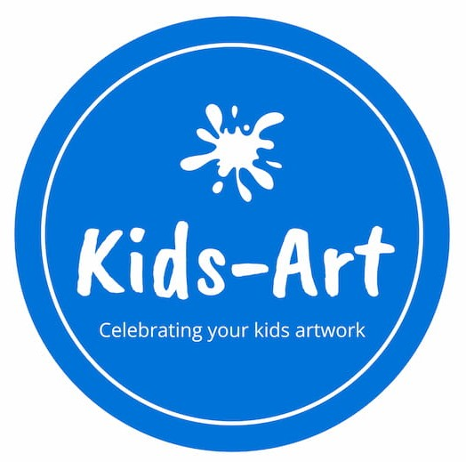
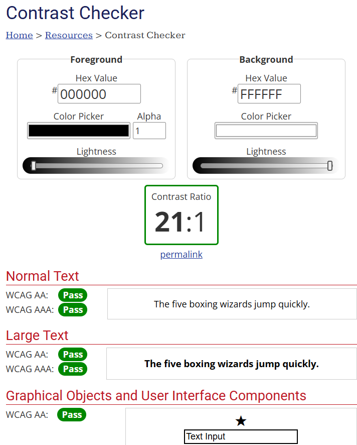
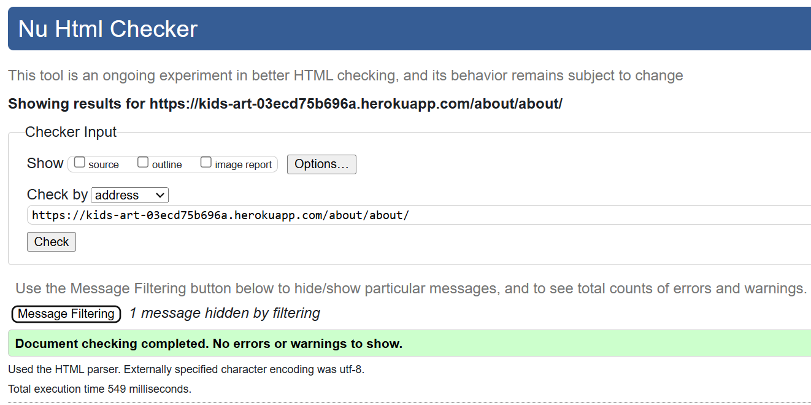

# Kids-Art (Capstone Project) <a id="top"/>
 
Kids-Art | Celebrating your kids artwork

## Introduction
The "Kids-Art" has been designed and implemented the final project for the Code Institute's 16-week AI-Augmented Full Stack Development Bootstrap course. 
Live site: [https://kids-art-03ecd75b696a.herokuapp.com/](https://kids-art-03ecd75b696a.herokuapp.com/)

## Table of Contents
- [User Experience Design](#user-experience-design)
- [Project Brief](#project-brief)
- [Users](#users)
- [Project Plan](#project-plan)
- [User Stories](#user-stories)
- [Wireframes](#wireframes)
- [Design](#design)
    - [Colour Scheme](#colour-scheme)
    - [Typography](#typography)
    - [Imagery](#imagery)
- [Website Features](#website-features)
    - [Homepage](#homepage)
    - [Footer](#footer)
    - [Pagination](#pagination)
    - [Profile](#profile)
    - [Create Post](#create-post)
- [Responsive Design](#responsive-design)
- [Future Features](#future-features)
- [Technologies Used](#technologies-used)
- [Deployment](#deployment)
- [Testing](#testing)
- [Credits](#credits)
    - [Code References](code-references)
    - [Use of AI](use-of-ai)
    - [Content References](content-references)
    - [Media References](media-references)
    - [Acknowledgements](acknowledgements)

[Back to top](#top)

## User Experience Design
For the develpmment of this site, I tried as mocuh as possible to follow user-centred approach throughout the inception and design of this site. 
Focusing the features in the user needs and their expectations.

### Project Brief
The project goal is to provide a platform for users to share the artwork made by their children, the user can also post art from younger people in their family.

The site user's goals are to to have access to the site to view their posts and other users posts also. Be able to create, update and delete their posts.
Leave comments on other users posts and share the site with family and friends intereted in seeing different artworks.

### Users
Persona 1: The Proud Parent 
Name: Sarah Thompson  Age: 35  Occupation: Marketing Manager  Interests: Family time, photography, gardening  About: Sarah is a busy mom of two, always looking for ways to celebrate her children's creativity. She loves sharing their artwork with family and friends and is an active participant in online communities. Sarah values positive feedback and is eager to connect with other parents who appreciate the joys of raising young artists.

Persona 2: The Aspiring Artist 
Name: Emily Harris  Age: 11  Occupation: Student  Interests: Drawing, painting, reading fantasy books  About: Emily is a young, talented artist who dreams of becoming a professional illustrator one day. She enjoys posting her artwork online and is keen on receiving constructive feedback to improve her skills. Emily loves interacting with other young artists and learning new techniques from them.

Persona 3: The Supportive Grandparent
Name: Robert Miller  Age: 68  Occupation: Retired Teacher  Interests: Reading, woodworking, spending time with grandchildren  About: Robert is a proud grandfather who cherishes his grandchildren's creative expressions. He enjoys logging in to the website to see their latest masterpieces and leave encouraging comments. Robert also appreciates connecting with other grandparents and sharing stories about their grandkids' artistic journeys.

## Project Plan
This project was planned on the first 2 days, with wireframes, colours, fonts being searched. 
Copilot was used to get user stories, personas, and throughout the overall site building. 
Adjustments were made the the content provided by Copilot as necessary and after testing the site. 
There were some elements of the webiste that were accomplished and some points that use different technologies form the ones studied during the course and would possibly take a very long time to be put in plase, thus not being viable to be incorporated by the submission date.

### User Stories
Here are all the user stories that have been prioritised (all must have and some should have ones) for the current implementation of the site:
| User Stories                                    | MoSCoW priority           |  Status |
| ----------------------------------------------- |:-------------------------:| -------:|
| Homepage                                        | must have                 |   Done  |

All user stories were logged on the [GitHub Project Board](https://github.com/users/Carlos-n21/projects/16) on GitHub repo, .

As well as .

[Back to top](#top)

### Wireframes
Initial layout of website:

- Mobile view: 
  
  
  
   
- Tablet view: 
   

Only done 2 views for tablet view as view is the same for tablet and computer screens 
Furhter images for other features on mobile view not included as the layout is the same for different screen sizes.

[Back to top](#top)

## Design
### Colour Scheme
- Coulour Palette
  

- Contrast check  
   
  

### Typography
Initial website font-family was Roboto and Lato.

For the website logo and title, used Caveat Brush and Open Sans, as per bellow images:
   
  

### Imagery
Some of the original sites used to get images for ficticious posts on the website.

  - [phhere.com](https://pxhere.com/en/photo/887571)
  - [NPS](https://www.nps.gov/neri/learn/news/youth-arts-in-the-parks-2023-art-contest-near-deadline.htm)

Hero Image
  
  

[Back to top](#top)

## Website Features
### Homepage
  
  
  
The navbar allows the user to navigate through the different areas of the site when not registered. 
When the user is on his account, allows to also see their profile, with all the posts created, also to create, edit and delete a post

### Footer
  

The footer contains links to different social networks that the site admin could use to post news about the website and to get more users to the website.

### Pagination
  

Have the number of pages on the bottom of the page allows the user, not just to move to the next or previous page, but also to go to a specific page, reducing the overload of content on one page and making it easier to access different pages quicker than just one at a time.

### Profile
  

Allows the user to see the post created, with option to edit them (in a different page) or to delete with a confirmation message.

### Create Post
  

The user can create a new post, after filling all the fields presented, except the Slug, that is automatically filled when filling the Title.

[Back to top](#top)

## Responsive Design
Almost all of the website content is reponsive to different screen sizes that different devices might have, through the use of Bootstrap. 

  

## Future Features
- Add likes to posts.
- Share posts on social media.
- Create albums with the posts created
- Add feature on Admin Panel to check which comments are approved and which are waiting for approval

## Technologies Used
### Languages and Technologies

### Libraries

### Tools and Programs

[Back to top](#top)

## Deployment

Heroku deployment process:

This project uses Heroku, a platform as a service (PaaS) that enables developers to build, run, and operate applications entirely in the cloud.
Deployment steps are as follows, after account setup:

Select New in the top-right corner of your Heroku Dashboard, and select Create new app from the dropdown menu.
Your app name must be unique, and then choose a region closest to you (EU or USA), and finally, select Create App.
From the new app Settings, click Reveal Config Vars, and set your environment variables.
| Key | Value |
| --- | --- |
| AWS_ACCESS_KEY_ID | user's own value |
| AWS_SECRET_ACCESS_KEY | user's own value |
| DATABASE_URL | user's own value |
| DISABLE_COLLECTSTATIC | 1 (this is temporary, and can be removed for the final deployment) |
| EMAIL_HOST_PASS | user's own value |
| EMAIL_HOST_USER | user's own value |
| SECRET_KEY | user's own value |
| STRIPE_PUBLIC_KEY | user's own value |
| STRIPE_SECRET_KEY | user's own value |
| STRIPE_WH_SECRET | user's own value |
| USE_AWS | True |
Heroku needs three additional files in order to deploy properly.
requirements.txt
Procfile
runtime.txt
You can install this project's requirements (where applicable) using:
pip3 install -r requirements.txt
If you have your own packages that have been installed, then the requirements file needs updated using:
pip3 freeze --local > requirements.txt
The Procfile can be created with the following command:
echo web: gunicorn app_name.wsgi > Procfile
replace app_name with the name of your primary Django app name; the folder where settings.py is located
The runtime.txt file needs to know which Python version you're using:
type: python3 --version in the terminal.
in the runtime.txt file, add your Python version:
python-3.9.19
For Heroku deployment, follow these steps to connect your own GitHub repository to the newly created app:
Either:
Select Automatic Deployment from the Heroku app.
Or:
In the Terminal/CLI, connect to Heroku using this command: heroku login -i
Set the remote for Heroku: heroku git:remote -a app_name (replace app_name with your app name)
After performing the standard Git add, commit, and push to GitHub, you can now type:
git push heroku main
The project should now be connected and deployed to Heroku!
 
Once the MVP was achieved and tested on Gitpod, the deployment was done on Heroku.

[Back to top](#top)

## Testing
Validation of HTML/CSS, Lighthouse Audits, Bugs

### HTML Validation
- Used [W3C Markup Validation Service](https://validator.w3.org/#validate_by_input) to test the HTML on all webpages and updated as needed. No errors found after fixing.

  
  
  
  
  
  
  

### CSS Validation

- Used [W3C CSS Validation Service](https://jigsaw.w3.org/css-validator/#validate_by_input) to test CSS style and no errors found.
  

### Lighthouse Audit

- Used Chrome Dev Tools Lighthouse to audit the site for response time and accessibility. 

  
  
  
  
  
  
  

### Test Results Summary

### 1. Test for Rendering the About Page with Collaboration Form

- **Test Name**: `test_render_about_page_with_collaborate_form`
- **Description**: Verifies that the About page is rendered correctly and contains the expected content, including the collaboration form.
- **Expected Outcome**:
  - Status code is 200 (OK).
  - Page content includes specific text: "About Kids-Art", "Welcome to Kids-Art", "Our Mission", "How It Works".
  - Collaboration form is included in the context.

### 2. Test for Submitting the Collaboration Form

- **Test Name**: `test_submit_collaborate_form`
- **Description**: Verifies that the collaboration form can be successfully submitted and processed.
- **Expected Outcome**:
  - Status code is 302 (redirect on successful form submission).

### 3. Test for Rendering the Blog Post Detail Page with Comment Form

- **Test Name**: `test_render_post_detail_page_with_comment_form`
- **Description**: Verifies that the blog post detail page is rendered correctly and contains the comment form.
- **Expected Outcome**:
  - Status code is 200 (OK).
  - Page content includes specific text: "Blog title", "Blog content".
  - Comment form is included in the context.

### 4. Test for Submitting a Comment on a Blog Post

- **Test Name**: `test_successful_comment_submission`
- **Description**: Verifies that a comment can be successfully submitted on a blog post.
- **Expected Outcome**:
  - Status code is 302 (redirect on successful comment submission).
  - Comment is created and needs approval.

### 5. Test for Required Name Field in Collaboration Form

- **Test Name**: `test_name_is_required`
- **Description**: Verifies that the name field is required in the collaboration form.
- **Expected Outcome**:
  - Form is invalid if the name field is empty.
  - Error message is present for the name field.

### 6. Test for Required Email Field in Collaboration Form

- **Test Name**: `test_email_is_required`
- **Description**: Verifies that the email field is required in the collaboration form.
- **Expected Outcome**:
  - Form is invalid if the email field is empty.
  - Error message is present for the email field.

### 7. Test for Required Message Field in Collaboration Form

- **Test Name**: `test_message_is_required`
- **Description**: Verifies that the message field is required in the collaboration form.
- **Expected Outcome**:
  - Form is invalid if the message field is empty.
  - Error message is present for the message field.

### 8. Test for Valid Collaboration Form

- **Test Name**: `test_form_is_valid`
- **Description**: Verifies that the collaboration form is valid when all required fields are provided.
- **Expected Outcome**:
  - Form is valid if all required fields are provided.

### 9. Test for Rendering the Blog Post List Page

- **Test Name**: `test_render_post_list_page`
- **Description**: Verifies that the blog post list page is rendered correctly.
- **Expected Outcome**:
  - Status code is 200 (OK).
  - Page content includes specific text related to blog posts.

### 10. Test for Rendering the User Profile Page

- **Test Name**: `test_render_profile_page`
- **Description**: Verifies that the user profile page is rendered correctly.
- **Expected Outcome**:
  - Status code is 200 (OK).
  - Page content includes specific text related to the user profile.

### 11. Test for Submitting a Collaboration Request

- **Test Name**: `test_successful_collaboration_request_submission`
- **Description**: Verifies that a collaboration request can be successfully submitted.
- **Expected Outcome**:
  - Status code is 200 (OK).
  - Page content includes specific text: "Collaboration request received! I endeavour to respond within 2 working days."

### 12. Test for Search Functionality

- **Test Name**: `test_search_functionality`
- **Description**: Verifies that the search functionality works correctly and returns the expected results.
- **Expected Outcome**:
  - Status code is 200 (OK).
  - Page content includes search results matching the query.

### ERD

  

### Bugs yet to be Fixed
- Comments update function on posts not working well, able to show updated comment but not deleting comment that was edited.
- When creating a new post, only able to publish and not safe as draft at the momment, site crashing, tried to debug, but unable to fix by the time of subimssion.
- "Currently" (image) on "Edit Post" page not showing link or image. Image showing under content. Was able to get this working once, but did not saved it, and was not able to get it to work again. Image still shows at the bottom, before update but extra field looks to be part of crispy forms and was not able to make it work.

[Back to top](#top)

## Credits
### Code References
Many of the features were based on/inspired by examples in the [Code Institute Bootcamp LMS](https://learn.codeinstitute.net/dashboard) on the use of HTML, CSS and Javascript.
 

### Use of AI
#### Code Generation
The GitHub Copilot extension was installed in our local versions of Visual Studio Code.  We were therefore able to write prompts or highlight functions in pseudocode and ask Copilot to suggest code snippets.  Suggestions needed to be reviewed before they were included, as occassionally code may refer to different features than the ones intended.

#### Debugging
Copilot was regularly used for debugging code using the inline editor. When using Chrome DevTools to inspect the preview or deployed pages.

#### Code Optimisation
When coding more complicated logical constructs, e.g. a complex iteration to loop through an array to generate innerHTML elements in a Bootstrap grid, the basic structure of the grid without the loop was assigned to the innerHTML of the target element. Once tested to run correctly, Copilot was prompted to optimise on the code. It suggested using a map method to loop through the options array to build the HTML for each element, and join them all together as a string. Again, this needed to be tested fully before it was incorporated into the code. Running the resultant code produces the same result as before. 

#### Impact on Workflow
On the whole, it has been useful to pair programme with Copilot and use it for debugging and testing as we code. Due to the tight timescale of the hackathon, the team tried to use AI wherever possible to reduce development time, from creating user stories to suggesting commit messages. It was also able to explain selected code written by other team members with a concise and accurate summary. Occassionally it can be annoying when Copilot suggests code in ghost text unnecessarily, or introduces additional closing tags or brackets unnecessarily. Nonetheless, when used with specific prompts and context, some of the results provided by Copilot have been mostly usable, thus speeding up development. 

### Content References

### Media References
[LOGO.com](https://logo.com/) Used to make the website logo 

### Acknowledgements
Everyone in our WECA group who have been so helpful and supportive leading up to this group project, and
Code Institute tutors (Dillon, Mark and Roo) and Bootcamp Coding Coaches for answering my questions

[Back to top](#top)